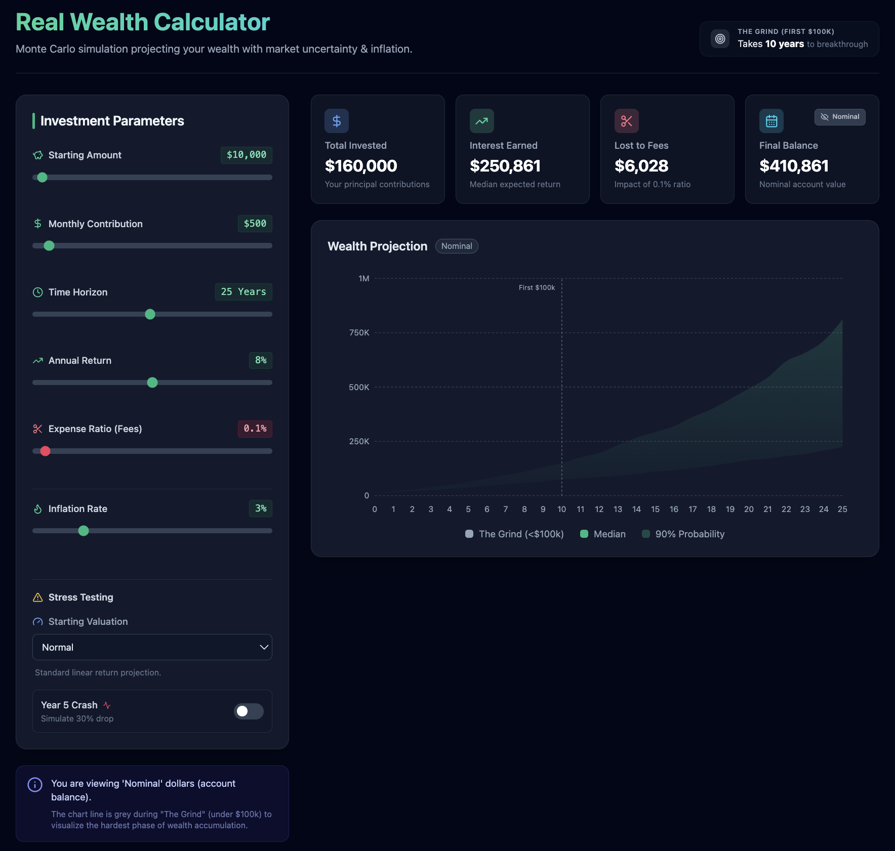

# Wealth Resilience Engine
### *A Realistic Compound Calculator*

> *"The first $100,000 is a bitch, but you gotta do it." - Charlie Munger*

## The Philosophy (Why I built this)
Most calculators show you a happy 8% return forever. I wanted to build something Howard Marks or Charlie Munger might actually approve of, something that focuses on avoiding ruin rather than just chasing returns.

## Features

### 1. The Cone of Uncertainty (Monte Carlo)
Instead of a single "prediction," this renders a probability cloud (10th to 90th percentile).
* **Why:** Because the future is a distribution, not a line.
  
### 2. "The Grind" Visualization
Munger famously said the first $100k is the hardest.
* **The Feature:** The chart line stays muted/grey until the portfolio crosses the $100k threshold.
* **Why:** It visually validates the struggle of the early years before compounding really kicks in.

### 3. The "Croupier's Cut" (Fee Drag)
* **The Feature:** A dynamic "Lost to Fees" counter.
* **Why:** You can see exactly how many thousands of dollars a "small" 1% expense ratio eats up over 25 years.

### 4. Stress Testing
* **Market Cycle Inputs:** Adjust starting valuations (High/Low P/E).
* **The "Black Swan" Switch:** Instantly simulate a 30% market crash in Year 5 to see if your plan survives.

### 5. Purchasing Power Mode (Real vs. Nominal)
Inflation is the invisible tax.
* **The Feature:** A toggle to switch the simulation between "Nominal" dollars (the number on the screen) and "Real" dollars (what that money actually buys in the future).
* **Why:** To ensure your returns are real wealth, not just inflation in disguise.
